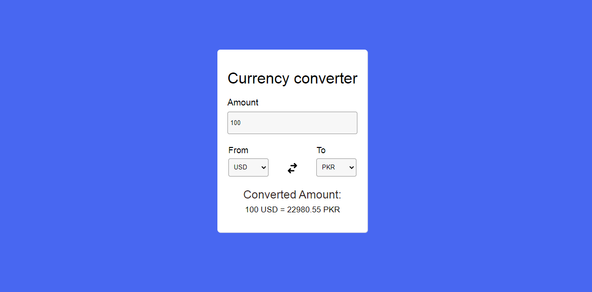

# Currency Converter
A  currency converter is an online application that enables the easy conversion of currency values based on currencies app exchange rates.

  

## Content
- [X] Use of Functional Components
- [X] Use of React Hooks
    - [X] useState
    - [X] useEffect
    

## Libraries and Frameworks
- [X] [sass](https://https://sass-lang.com/)
- [X] [TypeScript](https://www.typescriptlang.org/)
